> 실행 계획에서 Index 사용 여부 확인

```sql
SELECT s.SupplierID, p.ProductID, p.ProductName, p.UnitPrice
FROM dbo.Suppliers AS s INNER JOIN dbo.Products AS p
  ON s.SupplierID = p.SupplierID
WHERE p.SupplierID = 2
```

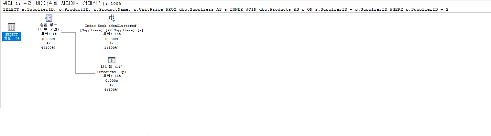

<br/>

---

<br/>

> Page IO 량 확인

```sql
SET STATISTICS IO ON;
```

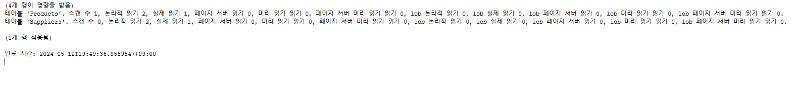

<br/>

---

<br/>

> 교환법칙, 결합법칙

```sql
SELECT *
FROM dbo.[Order Details]
WHERE (Discount <> 0)
AND (10 / Discount > 0)

   -- vs.
   SELECT *
   FROM dbo.[Order Details]
   WHERE (10 / Discount > 0)
   AND (Discount <> 0)
```

**Discount 컬럼이 0이 있으면 나누기 계산식에서 오류가 발생한다. 위에 쿼리 에서는 Discount <> 0으로 선행 조건을 주어 오류를 피하게 하였는데 밑에 쿼리 에서는 선행으로 조건을 안 주어도 오류가 나지 않는다.**

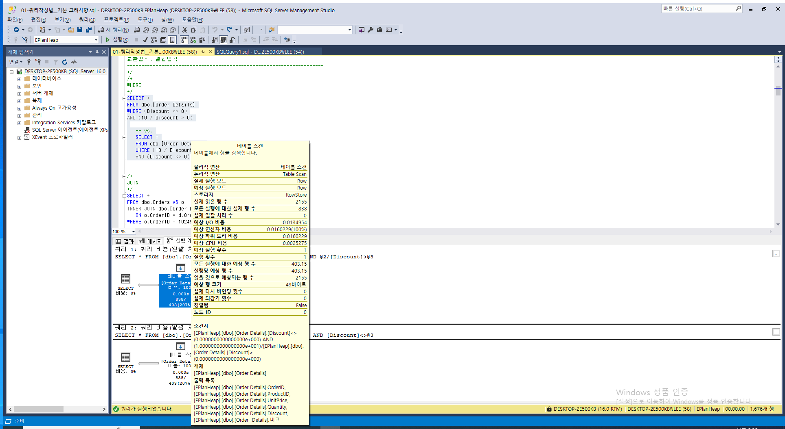

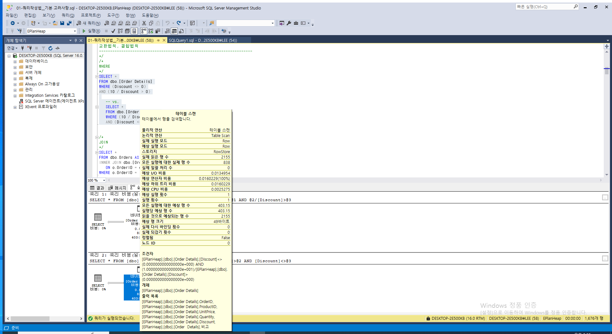

실행 계획으로 보니 둘다 Discount <> 0이 선행으로 조건 처리가 되어진다.

**\* Optimizer가 더 좋은 순서로 쿼리를 재구성 하고있다.**

```sql
SELECT *
FROM dbo.Orders AS o
INNER JOIN dbo.[Order Details] AS d
   ON o.OrderID = d.OrderID
WHERE o.OrderID = 10249

   -- vs.
   SELECT *
   FROM dbo.[Order Details] AS d
   INNER JOIN dbo.Orders AS o
      ON d.OrderID = o.OrderID
   WHERE d.OrderID = 10249
```

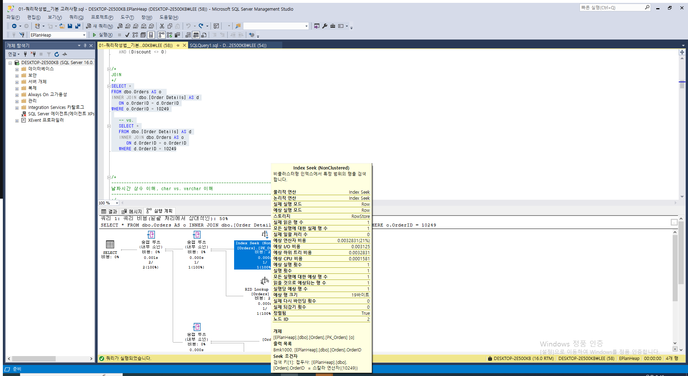

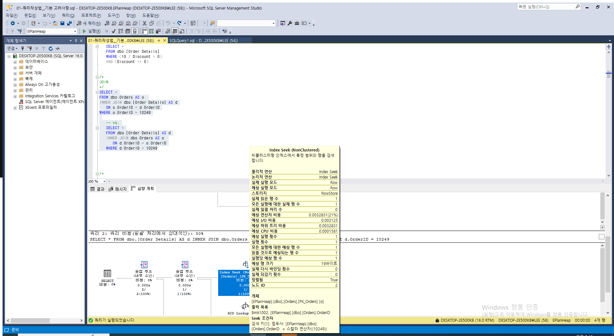

마찬가지로 JOIN 절도 Optimizer가 더 좋은 순서로 쿼리를 재구성하고 있다.

**하지만 OUTER JOIN을 사용하게 될 경우 순서에 따라 결과가 달라지므로 Optimizer가 최적화하는 데에 제한이 생기게 되므로 쿼리 재구성은 INNER JOIN만 해당한다.**

<br/>

---

<br/>

> 날짜시간 상수 이해, char vs. varchar 이해

```sql
DECLARE @d datetime = '20210615 23:59:59.997'
SELECT @d;
```

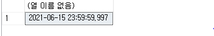

```sql
DECLARE @d datetime = '20210615 23:59:59.998'
SELECT @d;
```


```sql
DECLARE @d datetime = '20210615 23:59:59.999'
SELECT @d;
```

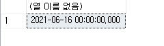

```sql
DECLARE @varchar varchar(8), @char char(8)
SELECT @varchar = 'sql   ', @char = 'sql   '

IF ( @varchar = 'sql' )
	PRINT '같다'

IF ( @char = 'sql' )
	PRINT '같다'

IF ( @varchar = @char )
	PRINT '같다'
```

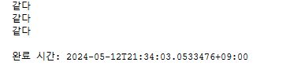

<br/>

---

<br/>

> 조인 조건 VS 검색 조건

```sql
SELECT
	o.OrderID, o.CustomerID, *
FROM
	dbo.Customers AS c
LEFT JOIN
	dbo.Orders AS o ON c.CustomerID = o.CustomerID
WHERE
	c.CustomerID IN ('FISSA', 'PARIS', 'ANTON')
	AND o.CustomerID IS NULL	/* 이 조건의 위치를 어디에 둘 것인가? */
```

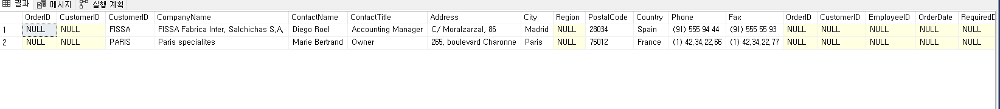

```sql
SELECT
	o.OrderID, o.CustomerID, *
FROM
	dbo.Customers AS c
LEFT JOIN
	dbo.Orders AS o ON c.CustomerID = o.CustomerID
    AND o.CustomerID IS NULL	/* 이 조건의 위치를 어디에 둘 것인가? */
WHERE
	c.CustomerID IN ('FISSA', 'PARIS', 'ANTON')
```

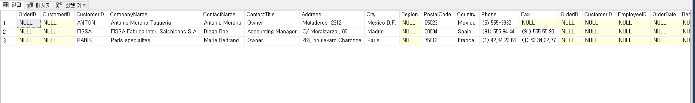

**OUTER JOIN을 사용할 때 조건을 어디에 위치하냐에 따라서 성능뿐만 아니라 데이터의 정합성이나 일관성에도 의도하지 않은 결과가 나올 수 있으며 성능 차치 하고도 조인 조건 또는 검색 조건에 의미에 맞게 작성해야 한다.**

<br/>

---

<br/>

> 의미 오류(Semantic Error)

1. 의미 오류 - 모순 조건

```sql
SELECT
	OrderDate
FROM
	dbo.Orders
WHERE
	OrderID IS NULL;	-- PK or NOT NULL

SELECT
    OrderDate
FROM
    dbo.Orders
WHERE
    ISNULL(OrderID, 0) = 10250;	-- 같은 내용

SELECT
    OrderID, ProductID
FROM
    dbo.[Order Details]
WHERE
    Quantity < 0;	-- CHECK (Quantity>(0))
```

2. 의미 오류 - 암시적인 or 동의 반복 or 모순된 조건식 포함

```sql
SELECT
	OrderDate
FROM
	dbo.Orders
WHERE
	ShipVia > 4 OR ShipVia > 2;


	/*
	그리고 또
	*/
	SELECT OrderDate, OrderID
	FROM dbo.Orders
	WHERE OrderID = 10248
		OR OrderID = 10250
		OR OrderID = 10250
		OR OrderID = 10250;


	SELECT OrderDate, OrderID
	FROM dbo.Orders
	WHERE OrderID IN (10248, 10250, 10250, 10250);


	-- 개념을 SQL로 표현하면
	SELECT OrderID, OrderDate
	FROM dbo.Orders
	WHERE OrderID IN (SELECT DISTINCT val
							FROM (
								VALUES (10248), (10250), (10250), (10250)
							) AS d(val));
```

3. 의미 오류 - 불필요한 DISTINCT

```sql
SELECT DISTINCT
	CustomerID, CompanyName, ContactName   -- CustomerID, CompanyName, ContactName pk일 경우
FROM
	dbo.Customers;
```

4. 의미 오류 - wildcard 없는 LIKE 연산자 (공백 고려는 제외)

```sql
SELECT
	OrderID, OrderDate, CustomerID
FROM
	dbo.Orders
WHERE
	CustomerID LIKE N'QUICK';
```

5. 의미 오류 - 불필요하게 복잡한 EXISTS (SELECT select-list)

```sql

IF EXISTS (SELECT DISTINCT OrderDate
				FROM dbo.Orders
				WHERE OrderID <= 10260)
SELECT 'OK'
```

6. 의미 오류 - 비효율적인 UNION --> UNION ALL로 대체 가능(두 결과의 중복 데이터가 없다면)

```sql
SELECT
	OrderID, OrderDate
FROM
	dbo.Orders
WHERE
	OrderID <= 10250
UNION
SELECT
	OrderID, OrderDate
FROM
	dbo.Orders
WHERE
	OrderID >= 11070;
```

7. 의미 오류 - 불필요한 조인 테이블

```sql
SELECT
	o.OrderID, o.OrderDate
FROM
	EPlan.dbo.BigOrders AS o				-- 자식
INNER JOIN EPlan.dbo.Customers AS c			-- 부모
	ON o.CustomerID = c.CustomerID	        -- 참조무결성
WHERE
	o.OrderID = 10250;
```

8. 의미 오류 - NOT IN과 NULL

```sql
SELECT
	e.ReportsTo
FROM
	dbo.Employees AS e
WHERE
	e.EmployeeID NOT IN (SELECT m.ReportsTo
								FROM dbo.Employees AS m);
```
