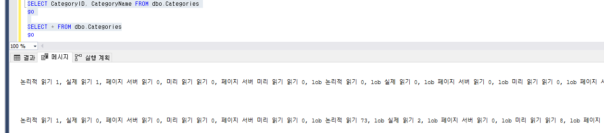
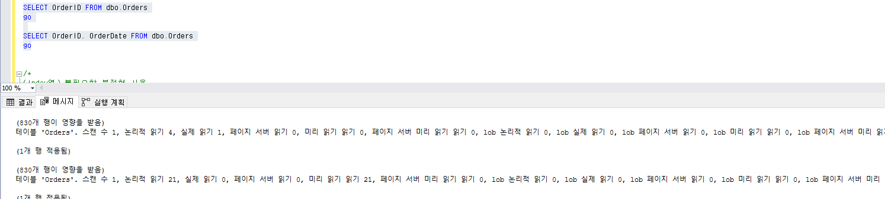
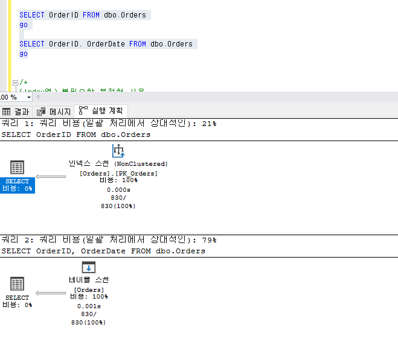
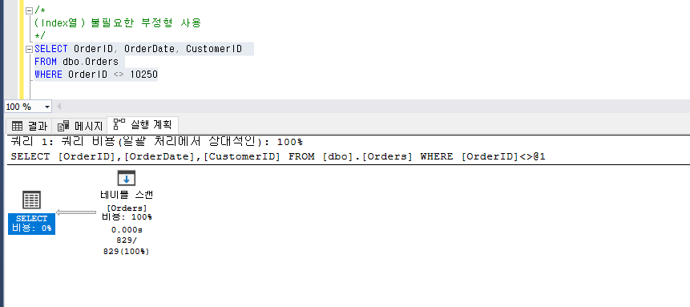
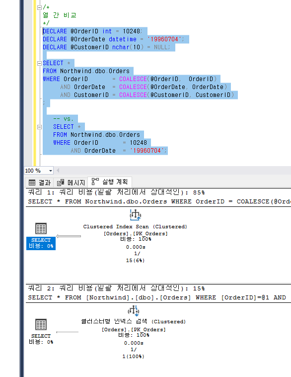
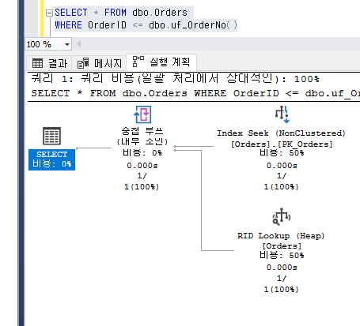
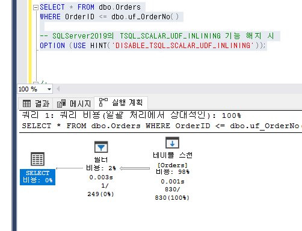
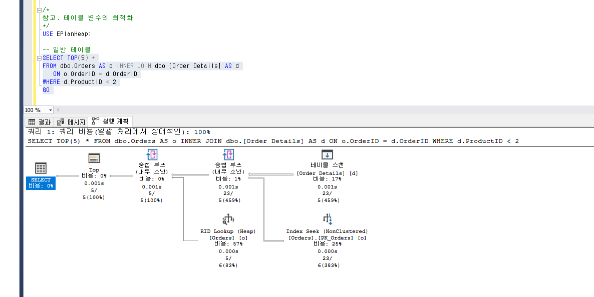
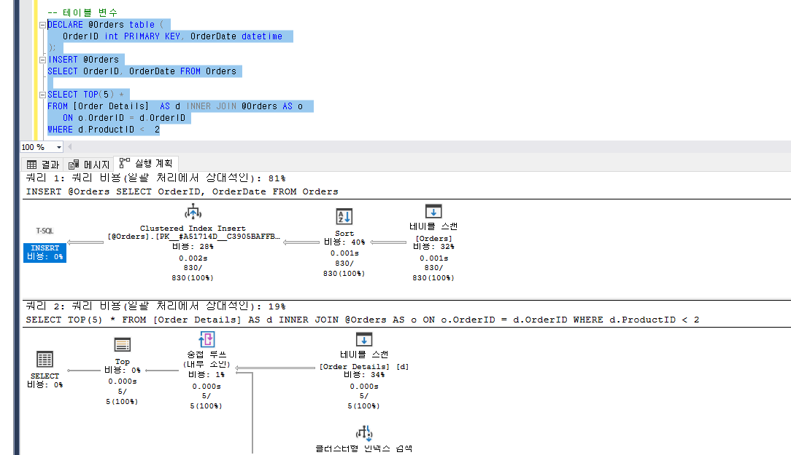
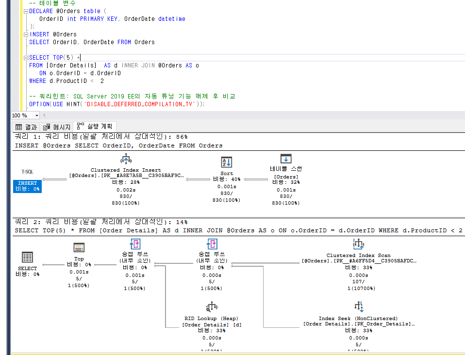

> 불필요한 컬럼 참조

```sql
-- IO 비교

SELECT CategoryID, CategoryName FROM dbo.Categories

SELECT * FROM dbo.Categories
```



```sql
SELECT OrderID FROM dbo.Orders

SELECT OrderID, OrderDate FROM dbo.Orders
```





<br/>

---

<br/>

> 부정형 사용 주의



- 참고. 조건은 "=" 이 가장 빠르고 효율적
- (index 조건에 따라) Optimizer가 긍정형으로 자동 변환
  - 그러나 결과는 항상 범위 검색
  - 불필요한 부정형(범위 검색)은 지양
- 검색 범위(행 수)가 적다면 긍정 조건 & 가능하면 "=" 조건으로 구현

<br/>

---

<br/>

> 불필요한 열 값 변형 1/3 - index열에 (사칙) 연산 적용

```sql
SELECT *
FROM EPlan.dbo.[Order Details]
WHERE OrderID + 10 = 10268
	AND ProductID = 5

-- 부등식에 따라 우변/좌변으로 변환

SELECT *
FROM EPlan.dbo.[Order Details]
WHERE OrderID = (10268 - 10)
  AND ProductID = 5
```

<br/>

---

<br/>

> 불필요한 열 값 변형 2/3 - index열에 함수 적용

```sql
-- 1. Substring, Left, Right
SELECT OrderID, OrderDate, CustomerID
FROM Northwind.dbo.Orders
WHERE SUBSTRING(CustomerID, 1, 3) = 'CEN'

   --정상 구현
	SELECT OrderID, OrderDate, CustomerID
	FROM Northwind.dbo.Orders
	WHERE CustomerID LIKE 'CEN%'


-- 2. Convert
SELECT OrderID, OrderDate, CustomerID
FROM Northwind.dbo.Orders
WHERE CONVERT(varchar(8), OrderDate, 112) = '19960704'

   --정상 구현
	SELECT OrderID, OrderDate, CustomerID
	FROM Northwind.dbo.Orders
	WHERE OrderDate >= '19960704' AND OrderDate < '19960705'


-- 3. datediff vs. dateadd
SELECT OrderID, ShippedDate, CustomerID
FROM Northwind.dbo.Orders
WHERE DateDiff(dd, ShippedDate, '19980506') <= 1

   --정상 구현
   SELECT OrderID, ShippedDate, CustomerID
   FROM Northwind.dbo.Orders
   WHERE ShippedDate >= DATEADD(dd, -1, '19980506')


-- 4. ISNULL
SELECT *
FROM Northwind.dbo.Orders
WHERE ISNULL(OrderDate, '19970702') = '19970702'

   --정상 구현
	SELECT *
	FROM Northwind.dbo.Orders
	WHERE (OrderDate = '19970702' OR OrderDate IS NULL)
```

<br/>

---

<br/>

> 불필요한 열 값 변형 3/3 - index열에 암시적 데이터 형 변환

- 식(expression)의 데이터 형식은 열과 동일한 형식으로

  - 주요 문제 대상
    - 문자 vs 숫자
    - 문자 vs 날짜
    - (var)char vs n(var)char

```sql
----------------------------------
-- char_column vs. 정수형
----------------------------------
SELECT stor_id, stor_name
FROM Pubs.dbo.Stores
WHERE stor_id >= 6380	-- Convert([stores].[stor_id]) = Convert([@1])

	-- vs.
	SELECT stor_id, stor_name
	FROM Pubs.dbo.Stores
	WHERE stor_id >= '6380'
```

<br/>

---

<br/>

> index열에 LIKE, 불필요한 또는 Non-SARG 유형

```sql
-- 정상
SELECT OrderID, OrderDate, CustomerID
FROM Northwind.dbo.Orders
WHERE CustomerID LIKE 'CE%'

-- 1) 불필요한 LIKE
SELECT OrderID, OrderDate, CustomerID
FROM Northwind.dbo.Orders
WHERE CustomerID LIKE 'VINET'

   SELECT OrderID, OrderDate, CustomerID
   FROM Northwind.dbo.Orders
   WHERE CustomerID = 'VINET'

-- 2) %로 시작
SELECT OrderID, OrderDate, CustomerID
FROM Northwind.dbo.Orders
WHERE CustomerID LIKE '%CE%'

-- 3) 숫자열
SELECT OrderID, OrderDate, CustomerID
FROM Northwind.dbo.Orders
WHERE OrderID LIKE '1024%'

-- 4) 날짜시간 열
SELECT OrderID, OrderDate, CustomerID
FROM Northwind.dbo.Orders
WHERE OrderDate LIKE '05% 1998%'
```

<br/>

---

<br/>

> 열 간 비교

- 열 간 비교되지 않도록 다른 형식으로 구현

```sql
DECLARE @OrderID int = 10248;
DECLARE @OrderDate datetime = '19960704';
DECLARE @CustomerID nchar(10) = NULL;

SELECT *
FROM Northwind.dbo.Orders
WHERE OrderID       = COALESCE(@OrderID,  OrderID)
     AND OrderDate  = COALESCE(@OrderDate, OrderDate)
     AND CustomerID = COALESCE(@CustomerID, CustomerID)

   -- vs.
   SELECT *
   FROM Northwind.dbo.Orders
   WHERE OrderID       = 10248
        AND OrderDate  = '19960704';
```



<br/>

---

<br/>

> index열 조건에 사용자 정의 함수 비교

- 사용자 정의 함수도 Non-SARG
  - 상수나 해당 식을 직접 사용
  - 해당 쿼리 직접 사용
- 참고 SQL Server 2019부터 "Scalar UDF Inline" 자동 튜닝 지원 (단, 선행 조건이 복잡)

```sql
CREATE OR ALTER FUNCTION dbo.uf_OrderNo()
RETURNS int
AS
BEGIN
   RETURN 10248
END;
GO

SELECT * FROM dbo.Orders
WHERE OrderID <= dbo.uf_OrderNo()
```



```sql
SELECT * FROM dbo.Orders
WHERE OrderID <= dbo.uf_OrderNo()
-- SQLServer2019의 TSQL_SCALAR_UDF_INLINING 기능 해지 시
OPTION (USE HINT('DISABLE_TSQL_SCALAR_UDF_INLINING'));
```



<br/>

---

<br/>

> 참고사항 - 테이블 변수의 최적화 이슈

- 쿼리 최적화 어려움 (vs 임시 테이블)
  - 이유는 행 수 예측이 안됨
    - SQL Server 2019 EE에서 자동 해결
- 성능 상 중요 쿼리인 경우
  - 쿼리 튜닝
  - 필요 시 임시 테이블 사용

```sql
-- 일반 테이블
SELECT TOP(5) *
FROM dbo.Orders AS o INNER JOIN dbo.[Order Details] AS d
   ON o.OrderID = d.OrderID
WHERE d.ProductID < 2
```



```sql
-- 테이블 변수
DECLARE @Orders table (
   OrderID int PRIMARY KEY, OrderDate datetime
);
INSERT @Orders
SELECT OrderID, OrderDate FROM Orders

SELECT TOP(5) *
FROM [Order Details]  AS d INNER JOIN @Orders AS o
   ON o.OrderID = d.OrderID
WHERE d.ProductID <  2
```



```sql
-- 테이블 변수
DECLARE @Orders table (
   OrderID int PRIMARY KEY, OrderDate datetime
);
INSERT @Orders
SELECT OrderID, OrderDate FROM Orders

SELECT TOP(5) *
FROM [Order Details]  AS d INNER JOIN @Orders AS o
   ON o.OrderID = d.OrderID
WHERE d.ProductID <  2

-- 쿼리힌트: SQL Server 2019 EE의 자동 튜닝 기능 해제 후 비교
OPTION(USE HINT('DISABLE_DEFERRED_COMPILATION_TV'));
```


