> IN vs Between

```sql
-- IN 이해
-- Nonclustered Index(PK, OrderID)
SELECT *
FROM EPlanHeap.dbo.Orders
WHERE OrderID IN (10248, 10249, 10250, 10251
					 , 10252, 10253)
```

```sql
-- BETWEEN 이해
SELECT *
FROM EPlanHeap.dbo.Orders
WHERE OrderID BETWEEN 10248 AND 10253
```

<br/>

---

<br/>

> TOP + ORDER BY 절 주의

```sql
SELECT TOP(5) Quantity, OrderID, ProductID
FROM EPlan.dbo.[Order Details]
ORDER BY Quantity DESC;

   SELECT TOP(12) Quantity, OrderID, ProductID
   FROM EPlan.dbo.[Order Details]
   ORDER BY Quantity DESC--, OrderID ASC;
```

<br/>

---

<br/>

> COUNT(\*) VS EXISTS

```sql
-- I/O 비교
IF (SELECT COUNT(*)
	FROM Eplan.dbo.[Order Details]
	WHERE Quantity > 50) > 0

  PRINT '있을까 없을까?'


IF EXISTS (SELECT *
		FROM Eplan.dbo.[Order Details]
		WHERE Quantity > 50)

	PRINT '있을까 없을까?'
```

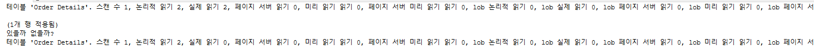

<br/>

---

<br/>

> NULL 고려한 집계 연산

```sql
SELECT SUM(Freight) FROM dbo.BigOrders

SELECT SUM(Freight) FROM dbo.BigOrders
WHERE Freight IS NOT NULL
```

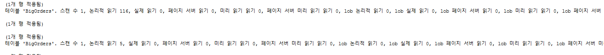

```sql
SELECT MIN(Freight) FROM dbo.BigOrders;

SELECT MIN(Freight) FROM dbo.BigOrders
WHERE Freight IS NOT NULL
```

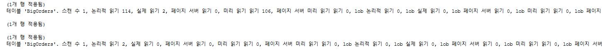

<br/>

---

<br/>

> 불필요한 GROUP BY 열 제거

```sql
SELECT c.CustomerID, CompanyName, COUNT(*)
FROM dbo.Customers AS c INNER JOIN dbo.Orders AS o
		ON c.CustomerID = o.CustomerID
GROUP BY c.CustomerID, CompanyName

```

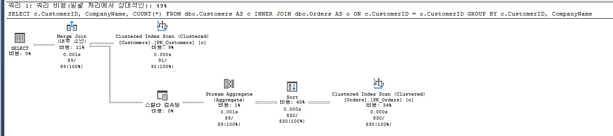

```sql
SELECT c.CustomerID, MAX(CompanyName), COUNT(*)
FROM dbo.Customers AS c INNER JOIN dbo.Orders AS o
		ON c.CustomerID = o.CustomerID
GROUP BY c.CustomerID
```

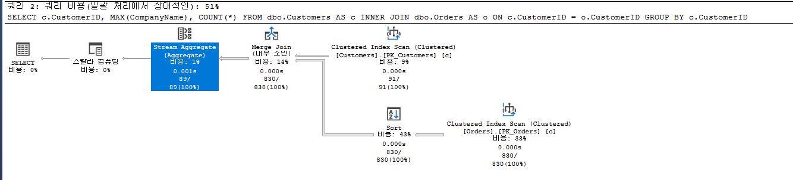

<br/>

---

<br/>

> UNION VS UNION ALL 차이 이해

```sql
SELECT firstname, city
 FROM Northwind.dbo.Employees
UNION
SELECT companyname, city
 FROM Northwind.dbo.Customers
GO

SELECT firstname, city
 FROM Northwind.dbo.Employees
UNION ALL
SELECT companyname, city
 FROM Northwind.dbo.Customers
```

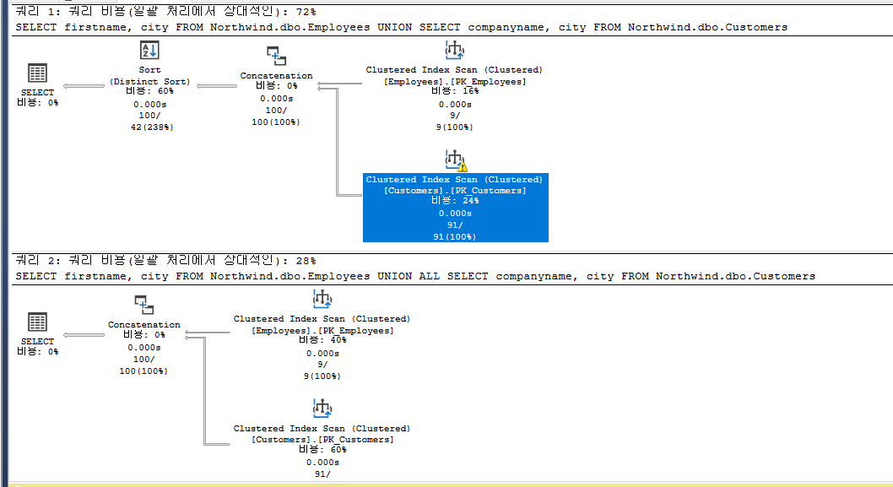

<br/>

---

<br/>

> UPDATE 결과 열 값 반환

```sql
DECLARE @OrderDate datetime;

BEGIN TRAN
   SELECT @@trancount;

   UPDATE dbo.Orders
   SET @OrderDate = OrderDate = OrderDate + 365
   WHERE OrderID = 10248;

   SELECT @OrderDate;

ROLLBACK
```

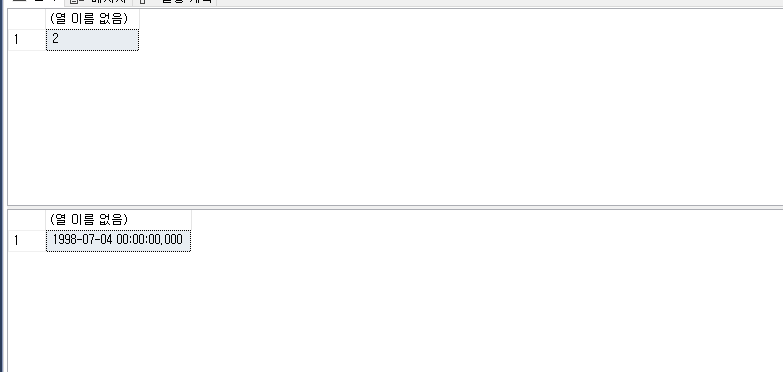

<br/>

---

<br/>

> DML 작업 결과 행 반환

```sql
BEGIN TRAN
   SELECT @@trancount;

   UPDATE dbo.Orders
   SET OrderDate = OrderDate + 365
   OUTPUT 'inserted', inserted.*, 'deleted', deleted.*
   WHERE OrderID = 10248;

ROLLBACK
```

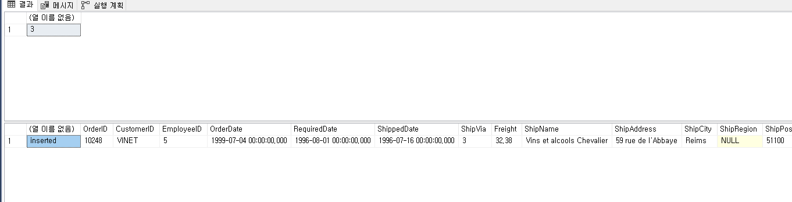
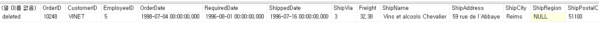

<br/>

---

<br/>

> Nested Loops(중첩 루프) Join 성능 이해

```sql
CREATE INDEX IX_BigOrders_CustomerID
ON dbo.BigOrders(CustomerID);
GO

SELECT c.CustomerID, c.CompanyName, o.OrderID, o.OrderDate
FROM dbo.Customers AS c INNER JOIN dbo.BigOrders AS o
    ON c.CustomerID = o.CustomerID
WHERE c.CustomerID IN ('VINET', 'VICTE');
```

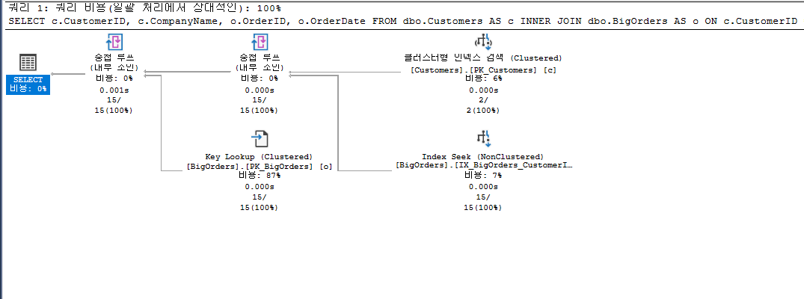

<br/>

---

<br/>

> 불필요한 OUTER JOIN

```sql
SELECT s.SupplierID, p.ProductID, p.ProductName, p.UnitPrice
FROM dbo.Suppliers AS s INNER JOIN dbo.Products AS p
  ON s.SupplierID = p.SupplierID
WHERE p.SupplierID = 2


SELECT s.SupplierID, p.ProductID, p.ProductName, p.UnitPrice
FROM dbo.Suppliers AS s RIGHT OUTER JOIN dbo.Products AS p
  ON s.SupplierID = p.SupplierID
WHERE p.SupplierID = 2
```

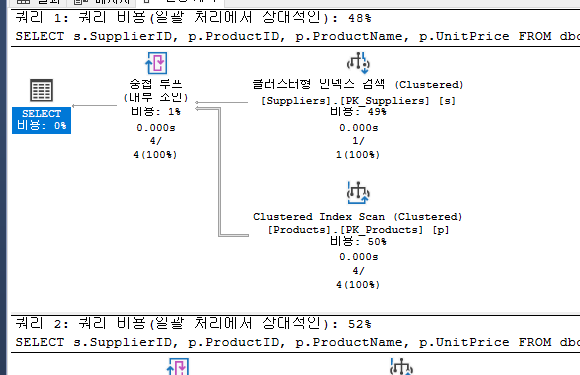

<br/>

---

<br/>

> Subquery 이해

```sql
-- 기본 조인
SELECT DISTINCT c.CompanyName
FROM dbo.Customers AS c INNER JOIN dbo.BigOrders AS o
ON c.CustomerID = o.CustomerID

-- 서브쿼리
SELECT c.CompanyName
FROM dbo.Customers AS c
WHERE EXISTS (SELECT *
   FROM dbo.BigOrders AS o
   WHERE c.CustomerID = o.CustomerID)
```

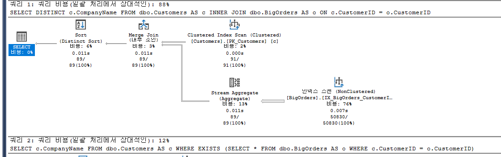

<br/>

---

<br/>

> JOIN을 이용한 중복 IO제거

```sql
SELECT OrderID
,  (
   SELECT COUNT(*) FROM dbo.[Order Details] AS d
   WHERE d.OrderID = o.OrderID
   ) AS OrderCnt
,  (
    SELECT SUM(Quantity) FROM dbo.[Order Details] AS d
   WHERE d.OrderID = o.OrderID
   ) AS QuantitySum

FROM dbo.Orders AS o
WHERE OrderID = 10248;


/*
---------------------------------------------------------------------
1) 파생테이블(인라인 뷰)을 이용한 경우
---------------------------------------------------------------------
*/
SELECT o.OrderID, OrderCnt, QuantitySum
FROM dbo.Orders AS o
LEFT JOIN (
   SELECT OrderID
      ,  COUNT(*) AS OrderCnt
      ,  SUM(Quantity) AS QuantitySum
   FROM dbo.[Order Details] AS d
   GROUP BY OrderID
   ) AS d
ON d.OrderID = o.OrderID
WHERE o.OrderID = 10248;


/*
---------------------------------------------------------------------
2) CTE를 이용한 경우
---------------------------------------------------------------------
*/
WITH ODSum(OrderID, OrderCnt, QuantitySum)
AS
(
   SELECT OrderID
      ,  COUNT(*)
      ,  SUM(Quantity)
   FROM dbo.[Order Details] AS d
   GROUP BY OrderID
)
SELECT o.OrderID, OrderCnt, QuantitySum
FROM dbo.Orders AS o
LEFT JOIN ODSum AS d
	ON d.OrderID = o.OrderID
WHERE o.OrderID = 10248;


/*
---------------------------------------------------------------------
3) (CROSS|OUTER) APPLY를 활용한 방법
---------------------------------------------------------------------
*/
SELECT o.OrderID, OrderCnt, QuantitySum
FROM dbo.Orders AS o
OUTER APPLY (
   SELECT
         COUNT(*) AS OrderCnt
      ,  SUM(Quantity) AS QuantitySum
   FROM dbo.[Order Details] AS d
   WHERE d.OrderID = o.OrderID
   ) AS d
WHERE o.OrderID = 10248;
```

<br/>

---

<br/>

> CASE 내부 Subquery 주의

```sql
SELECT
	OrderID,
	CASE (SELECT Country FROM dbo.Customers cu WHERE cu.CustomerID = oh.CustomerID)
		WHEN 'Germany' THEN 'Germany'
		WHEN 'Mexico' THEN 'Mexico'
		WHEN 'UK' THEN 'UK'
		ELSE 'N/A'
	END
FROM dbo.Orders AS oh
WHERE OrderID <= 10250;


/*
권장 - Subquery 내 CASE
*/
SELECT
	OrderID,
	(SELECT CASE Country
				WHEN 'Germany' THEN 'Germany'
				WHEN 'Mexico' THEN 'Mexico'
				WHEN 'UK' THEN 'UK'
				ELSE 'N/A'
			END
	FROM dbo.Customers cu
	WHERE cu.CustomerID = oh.CustomerID) AS Country
FROM dbo.Orders AS oh
WHERE OrderID <= 10250;
```

<br/>

---

<br/>

> SELECT 쿼리 잠금 차단 회피

```sql
-- 프로시저/배치 수준
SET LOCK_TIMEOUT 3000
SET TRANSACTION ISOLATION LEVEL READ UNCOMMITTED

-- 구문 수준
SELECT * FROM table WITH(NOLOCK) -- OR READUNCOMMITTED
```
