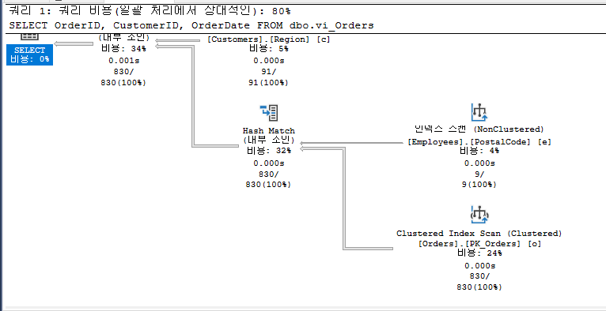
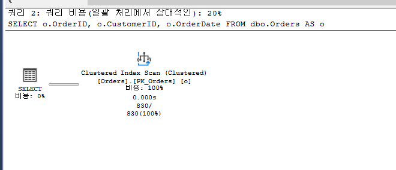
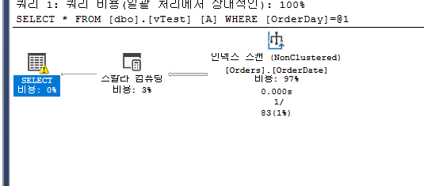

> Cursor 사용 권장 사항

```sql

-- 1) Cursor를 이용한 Pivoting

SET NOCOUNT ON

IF OBJECT_ID('tempdb.dbo.#Order_Cnt') IS NOT NULL
	DROP TABLE #Order_Cnt

CREATE TABLE #Order_Cnt (
  EmpID  int
, Emp_Cnt  int
, France   int
, Germany  int
, Argentina   int
)

DECLARE EmployeeInfo CURSOR
FOR SELECT DISTINCT EmployeeID FROM dbo.Orders

OPEN EmployeeInfo

DECLARE @EmployeeID int
FETCH NEXT FROM EmployeeInfo INTO @EmployeeID
WHILE @@FETCH_STATUS = 0
BEGIN

	INSERT #Order_Cnt
	SELECT
			@EmployeeID
	  , Emp_Cnt = (SELECT COUNT(EmployeeID)
	                FROM dbo.Orders
	                WHERE EmployeeID = @EmployeeID
	                  AND ShipCountry IN ('France', 'Germany', 'Argentina') )

	  , [France] = ( SELECT COUNT(EmployeeID)
	                 FROM dbo.Orders
	                 WHERE EmployeeID = @EmployeeID
							AND ShipCountry = 'France' )

	  , [Germany] = (SELECT COUNT(EmployeeID)
	                 FROM dbo.Orders
	                 WHERE EmployeeID = @EmployeeID
							AND ShipCountry = 'Germany' )

	  , [Argentina] = (SELECT COUNT(EmployeeID)
	                 FROM dbo.Orders
	                 WHERE EmployeeID = @EmployeeID
							AND ShipCountry = 'Argentina' )

  FETCH NEXT FROM EmployeeInfo INTO @EmployeeID
END

CLOSE EmployeeInfo
DEALLOCATE EmployeeInfo

SELECT * FROM #Order_Cnt
ORDER BY EmpID;

SET NOCOUNT OFF


-- 2) T-SQL: CASE + GROUP BY로 구현한 경우
SELECT EmployeeID
	, EmpCnt = COUNT(EmployeeID)
	, [France]= COUNT(CASE ShipCountry WHEN 'France' THEN 1 END)
	, [Germany] = COUNT(CASE ShipCountry WHEN 'Germany' THEN 1 END)
	, [Argentina] = COUNT(CASE ShipCountry WHEN 'Argentina' THEN 1 END)
FROM Orders
WHERE
	ShipCountry IN ('France', 'Germany', 'Argentina')
GROUP BY EmployeeID
ORDER BY EmployeeID;


-- T-SQL: PIVOT 으로 구현한 경우
SELECT EmployeeID
	, EmpCnt = [France]+[Germany]+[Argentina]
	, [France], [Germany], [Argentina]
FROM (
	SELECT EmployeeID, ShipCountry
	FROM Orders
) AS Orders
PIVOT (
	COUNT(ShipCountry) FOR ShipCountry IN ([France], [Germany], [Argentina])
) AS Pivots
ORDER BY EmployeeID;


/*
-------------------------------------------------------------
--  Row to Column
-------------------------------------------------------------
*/
SELECT CustomerID
FROM Northwind.dbo.Orders
WHERE OrderID <= 10250;


-- STRING_AGG() 활용 - 2017+
SELECT STRING_AGG(CustomerID, ',') AS CustomerIDs
FROM Northwind.dbo.Orders
WHERE OrderID <= 10250;


-- 1) 기본 Cursor

DECLARE ProductQty CURSOR
FOR SELECT ProductID, Quantity FROM dbo.[Order Details]

OPEN ProductQty

DECLARE @ProductID int, @Quantity int
FETCH NEXT FROM ProductQty INTO @ProductID, @Quantity
WHILE @@FETCH_STATUS = 0
BEGIN

   UPDATE Products
   SET ProductTotalQty = ISNULL(ProductTotalQty, 0) + @Quantity
   WHERE ProductID = @ProductID

   FETCH NEXT FROM ProductQty INTO @ProductID, @Quantity
END

CLOSE ProductQty
DEALLOCATE ProductQty

SELECT ProductTotalQty, * FROM dbo.Products;


-- 2) Local + FAST_FORWARD

DECLARE ProductQty CURSOR LOCAL FAST_FORWARD -- FAST_FORWARD or FORWARD_ONLY STATIC READ_ONLY
FOR SELECT ProductID, Quantity FROM dbo.[Order Details]

OPEN ProductQty

DECLARE @ProductID int, @Quantity int
FETCH NEXT FROM ProductQty INTO @ProductID, @Quantity
WHILE @@FETCH_STATUS = 0
BEGIN

   UPDATE Products
   SET ProductTotalQty = ProductTotalQty + @Quantity
   WHERE ProductID = @ProductID

   FETCH NEXT FROM ProductQty INTO @ProductID, @Quantity
END

CLOSE ProductQty
DEALLOCATE ProductQty

-- 정리
ALTER TABLE Products
  DROP COLUMN ProductTotalQty;
```

<br/>

---

<br/>

> 만능 View는 위험

```sql
CREATE OR ALTER VIEW dbo.vi_Orders
AS
SELECT o.OrderID, o.CustomerID, o.OrderDate, e.LastName
  ,  c.CompanyName, c.Address
FROM dbo.Customers AS c
  INNER JOIN dbo.Orders AS o
    ON c.CustomerID = o.CustomerID
  INNER JOIN dbo.Employees AS e
    ON e.EmployeeID = o.EmployeeID


-- View vs. Join
SELECT OrderID, CustomerID, OrderDate
FROM dbo.vi_Orders

SELECT o.OrderID, o.CustomerID, o.OrderDate
FROM dbo.Orders AS o
```




<br/>

---

<br/>

> View 내에서 Index 열 변형 주의

```sql
CREATE OR ALTER VIEW dbo.vTest
AS
SELECT OrderID
   ,  CONVERT(varchar(10), OrderDate, 112) AS OrderDay
   ,  OrderDate
FROM dbo.Orders
GO

SELECT *
FROM dbo.vTest A
WHERE OrderDay = '19960704';
```



<br/>

---

<br/>

> User Defined Function 성능 이슈 1/2

```sql
CREATE OR ALTER FUNCTION dbo.fn_OrderSum
( @ProductID int )
RETURNS int
AS
BEGIN
  RETURN (
    SELECT SUM(Quantity)
    FROM [Order Details]
    WHERE ProductID = @ProductID
  )
END


/*
  서브쿼리 자체 I/O 평가
*/
SELECT SUM(Quantity)
    FROM [Order Details]
    WHERE ProductID = 1

--'Order Details' 테이블. 스캔 수 1, 논리적 읽기 수 11, 물리적 읽기 수 0, 미리 읽기 수 0.

/*
SELECT 절에서 함수 호출 시 I/O
*/
SELECT ProductName, dbo.fn_OrderSum(ProductID)
FROM dbo.Products
WHERE ProductID <= 5
--테이블 'Products'. 검색 수 1, 논리적 읽기 수 2, 물리적 읽기 수 1, 미리 읽기 수 0, LOB 논리적 읽기 수 0, LOB 물리적 읽기 수 0, LOB 미리 읽기 수 0.

/*
vs. 함수없이 쿼리에서 직접 처리한 경우
*/
SELECT ProductName
  , ( SELECT SUM(Quantity)
       FROM [Order Details] d
       WHERE d.ProductID = p.ProductID )
FROM dbo.Products AS p
WHERE ProductID <= 5

/*
아래 결과는 실행계획의 테이블 순서에 따라 달라짐
*/
--테이블 'Order Details'. 스캔 수 5, 논리적 읽기 55, 실제 읽기 0, 페이지 서버 읽기 0, 미리 읽기 읽기 0, 페이지 서버 미리 읽기 읽기 0, lob 논리적 읽기 0, lob 실제 읽기 0, lob 페이지 서버 읽기 0, lob 미리 읽기 읽기 0, lob 페이지 서버 미리 읽기 읽기 0.
--테이블 'Products'. 스캔 수 1, 논리적 읽기 2, 실제 읽기 0, 페이지 서버 읽기 0, 미리 읽기 읽기 0, 페이지 서버 미리 읽기 읽기 0, lob 논리적 읽기 0, lob 실제 읽기 0, lob 페이지 서버 읽기 0, lob 미리 읽기 읽기 0, lob 페이지 서버 미리 읽기 읽기 0.

```

<br/>

---

<br/>

> User Defined Function 성능 이슈 2/2

```sql
CREATE OR ALTER FUNCTION dbo.if_Orders
( @date datetime )
RETURNS table
AS
RETURN
    SELECT CustomerID, EmployeeID, COUNT(*) AS Cnt
    FROM   dbo.Orders
    WHERE  OrderDate >= @date
    GROUP BY CustomerID, EmployeeID

SELECT * FROM dbo.if_Orders ('19980506');
```
